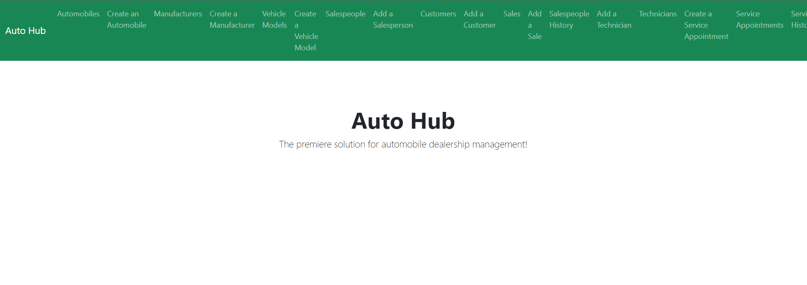

# Customer Graphical Human Interface

## Home Page

This will be the first page visitors arrive to on the website.  Navbar will provide link to various forms and views.

## Automobile Inventory Page

This page will display list of all inventory.  Both sold and unsold.

## Create Automobile Form

This page will allow user to add an automobile to inventory.  Note, a model and manufacturer must be created first.

## Manufacturers List

This page will show all available manufacturers for your facility.

## Manufacturers Form

This page will show allow user to enter a new manufacturer.

## Vehicle Models

This page will display the list of vehicle models.  Manufacturer and picture of vehicle will be provided.

## Vehicle Models Form

This page will allow user to create a new vehicle model.

## Salespeople List

This page will display list of salespeople.

## Salesperson Form

This page will allow user to create a new salesperson.

## Customer List

This page will display the list of customers with pertinent contact information.

## Customer Form

This page will display a form to add new customer to database.

## Record a new sale

This page will display a form that allows user to enter a new sale.

## Add a technician

This page will display a form that allows user to add a new technician.

## Technician List

This page will display a list of all technicians.

## Create a service appointment

This page will display a form that allows user enter a new service appointment.

## Service appointment list

This page will display a list of active service appointments.  Additional functionality will allow you to select button to "Cancel" or "Finish".  This will move service appointment to service history view.

## Service history

This page will display a list of service history.  Status will be displayed of either "created", "canceled" or "finished".

